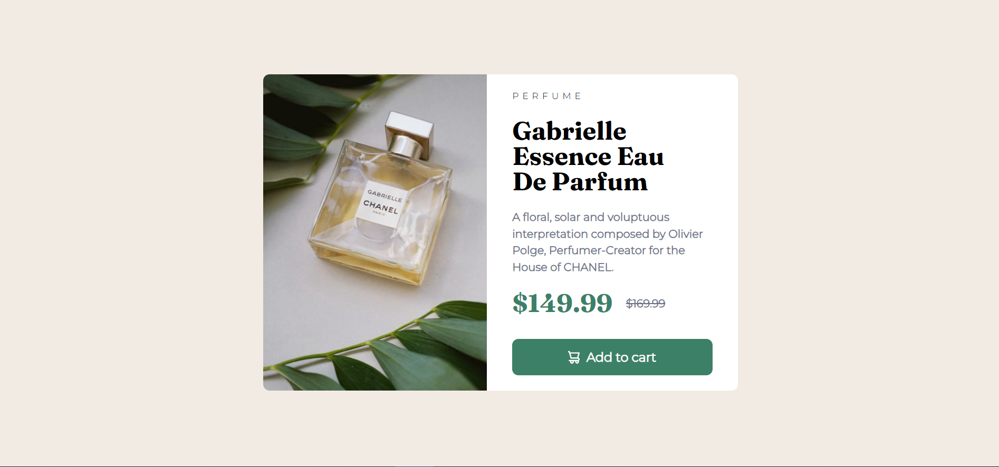

# Frontend Mentor - Product preview card component solution

This is a solution to the [Product preview card component challenge on Frontend Mentor](https://www.frontendmentor.io/challenges/product-preview-card-component-GO7UmttRfa). Frontend Mentor challenges help you improve your coding skills by building realistic projects.

## Table of contents

- [Overview](#overview)
  - [The challenge](#the-challenge)
  - [Screenshot](#screenshot)
  - [Links](#links)
- [My process](#my-process)
  - [Built with](#built-with)
  - [What I learned](#what-i-learned)
  - [Useful resources](#useful-resources)
- [Author](#author)

## Overview

### The challenge

Users should be able to:

- View the optimal layout depending on their device's screen size
- See hover and focus states for interactive elements

### Screenshot

### Links

- Solution URL: [Add solution URL here](https://your-solution-url.com)
- Live Site URL: [Add live site URL here](https://your-live-site-url.com)

## My process

### Built with

- Semantic HTML5 markup
- Flexbox
- CSS Grid
- Mobile-first workflow

### What I learned

I have learned on how to make resonsive images using the `<picture>` element, making the card responsive by using grid and flexbox for larger screens which was one of my setbacks with this project. I've also learned on how to easily add icons using the `data-icon="shopping-cart"` and adding it into  the `<button>` element and styling the icon in CSS using the `::before` attribute. 

### Useful resources

- [Josh Comeau Css reset](https://www.joshwcomeau.com/css/custom-css-reset/)
- [Google fonts](https://fonts.google.com) - Fonts used for this challenge
- [This one helped me for aligning the svg with the text in the button element](https://codepen.io/TheDutchCoder/pen/gOojqK?editors=1100)
- [Kevin Powell](https://www.youtube.com/watch?v=B2WL6KkqhLQ)

## Author

- Website - [My Website](https://personal-porfolio-website-coral.vercel.app/index.html)
- Frontend Mentor - [@Edixlk](https://www.frontendmentor.io/profile/Edixlk)
- Twitter - [@nixc67](https://x.com/nixc67)
